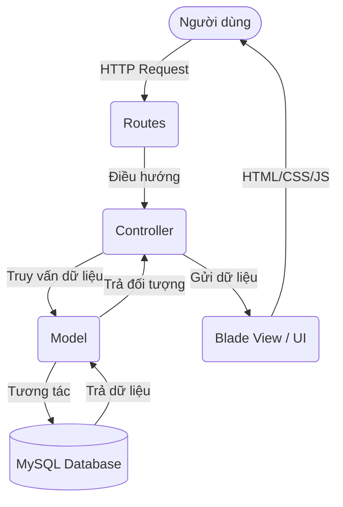
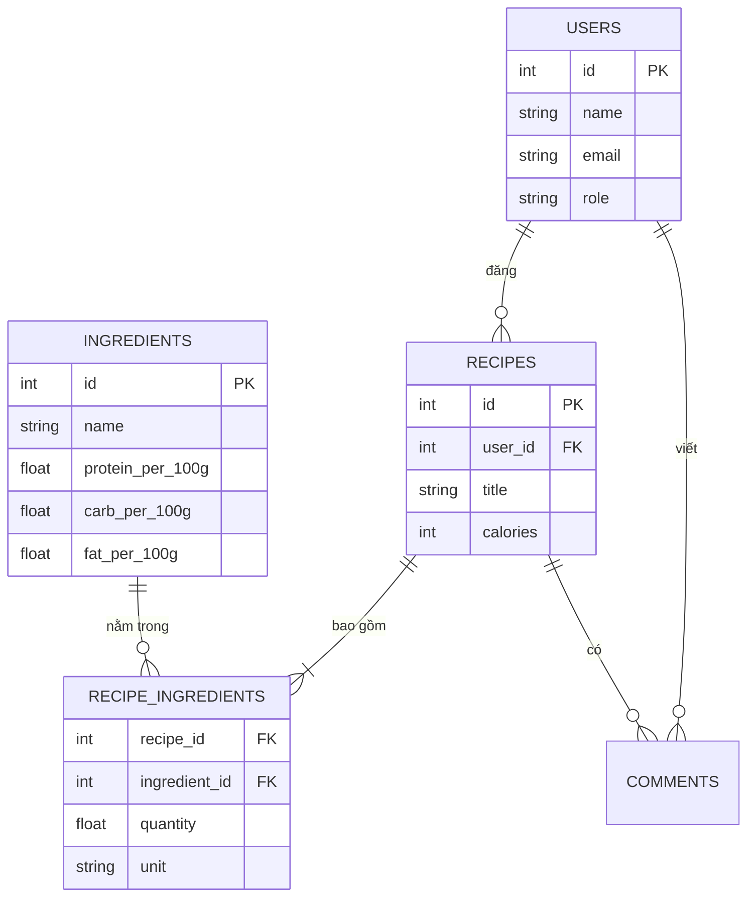
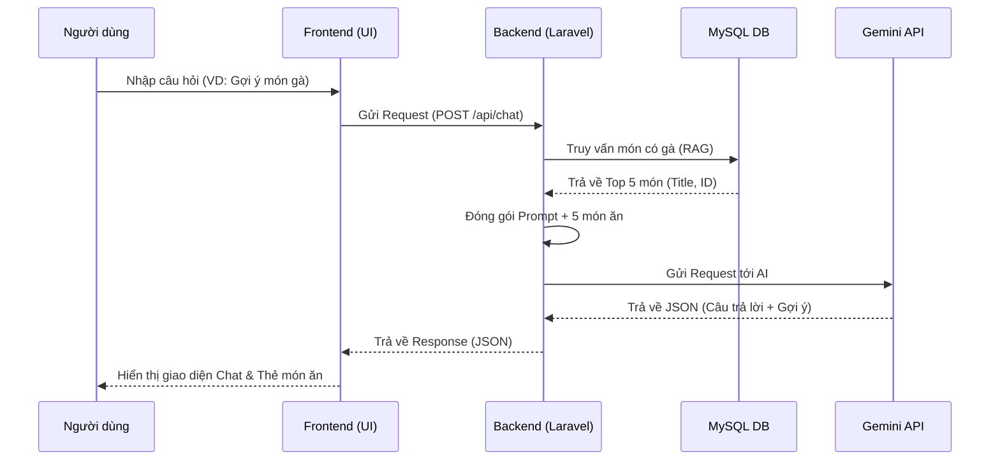
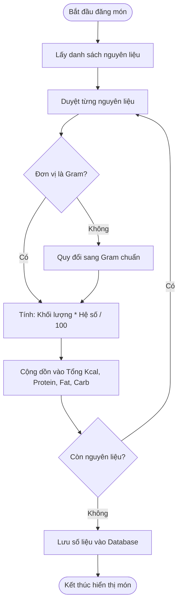
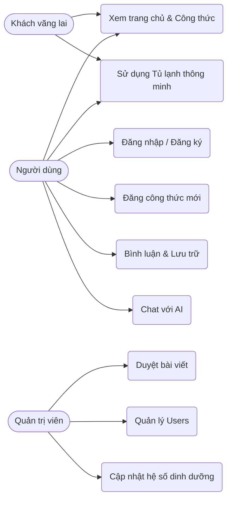
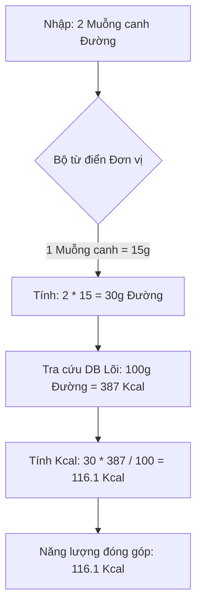
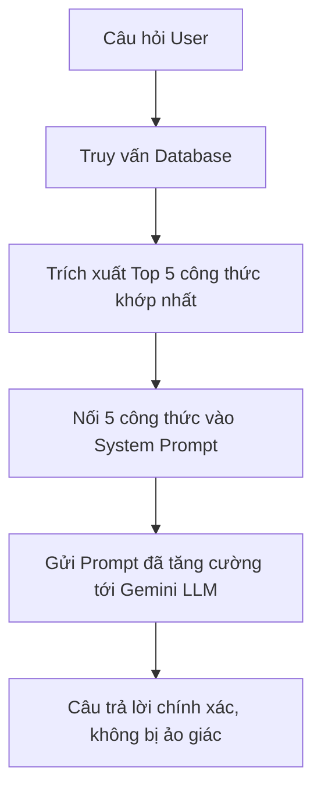
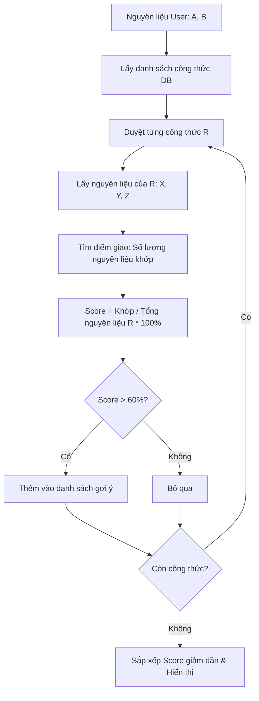

# ĐỀ TÀI: Nền tảng mạng xã hội ẩm thực và Hỗ trợ tính toán dinh dưỡng thông minh tích hợp AI

## Danh mục Hình ảnh
- **Hình 1.1:** Sơ đồ kiến trúc tổng thể của hệ thống MVC
- **Hình 1.2:** Lược đồ cơ sở dữ liệu (ERD) của hệ thống
- **Hình 1.3:** Sơ đồ luồng giao tiếp dữ liệu giữa Người dùng - Backend - AI Model
- **Hình 1.4:** Giao diện Trợ lý ảo AI hoạt động trên nền tảng
- **Hình 1.5:** Sơ đồ thuật toán chuẩn hóa đơn vị và tính toán Kcal tự động
- **Hình 1.6:** Giao diện hiển thị biểu đồ phân bổ dinh dưỡng (Macros) của món ăn
- **Hình 1.7:** Biểu đồ Use-case các tác vụ của Người dùng và Quản trị viên
- **Hình 1.8:** Giao diện tính năng Tủ lạnh thông minh (Smart Search)
- **Hình 2.1:** Sơ đồ tháp dinh dưỡng và Công thức phân bổ năng lượng tiêu chuẩn
- **Hình 2.2:** Lưu đồ thuật toán quy đổi đơn vị đo lường (thìa, bát) sang Gram và nhân hệ số Macros lõi
- **Hình 2.3:** Kiến trúc mạng Transformer và cơ chế Self-Attention trong LLM
- **Hình 2.4:** Sơ đồ nguyên lý hoạt động của kiến trúc RAG tích hợp AI trên nền tảng
- **Hình 2.5:** Lưu đồ thuật toán chấm điểm độ khớp nguyên liệu (Matching Algorithm Flowchart)

## Danh mục Bảng biểu
- **Bảng 2.1:** Hệ số vận động (Activity Multiplier) trong tính toán TDEE
- **Bảng 2.2:** Hệ số quy đổi năng lượng của nhóm Đa lượng (Macros)
- **Bảng 2.3:** Ánh xạ cấu trúc dữ liệu phản hồi của hệ thống AI

---

## I. Nội dung Đề tài (Subject Matter)

### 1. Tổng quan lĩnh vực và xu hướng công nghệ
- Phân tích nhu cầu nấu ăn tại nhà và xu hướng sống khỏe, ăn uống khoa học (Healthy Eating) trong đời sống hiện đại.
- Khảo sát các mô hình mạng xã hội ẩm thực hiện có (Cookpad, Tasty, Yummly) và những hạn chế về mặt cá nhân hóa dinh dưỡng.
- Tổng quan về việc ứng dụng công nghệ (AI, thuật toán) trong việc gợi ý thực đơn thông minh từ nguyên liệu có sẵn và tự động hóa khâu tính toán dinh dưỡng.

### 2. Phân tích và Thiết kế Hệ thống
- **Kiến trúc hệ thống**: Xây dựng theo mô hình MVC (Model-View-Controller) với 3 thành phần chính:
  - **Backend**: Sử dụng Laravel Framework (PHP) để quản lý cơ sở dữ liệu người dùng, công thức, nguyên liệu, và xử lý logic tính toán dinh dưỡng/giao tiếp với AI.
  - **Frontend**: Giao diện người dùng hiện đại, Responsive đa thiết bị (đặc biệt tối ưu cho Mobile) và tối ưu hóa trải nghiệm nấu ăn thực tế (Cooking Mode).
  - **Admin Dashboard**: Giao diện quản trị viên dùng để kiểm duyệt bài đăng, quản lý danh mục ẩm thực, cập nhật cơ sở dữ liệu nguyên liệu lõi và xử lý báo cáo vi phạm.
- **Thiết kế Cơ sở dữ liệu**: Lược đồ CSDL quản lý chặt chẽ cấu trúc người dùng, bài đăng công thức, các bước thực hiện, chi tiết định lượng nguyên liệu, thông tin dinh dưỡng, hệ thống tương tác (bình luận, lưu trữ, bộ sưu tập cá nhân).

> **Hình 1.1: Sơ đồ kiến trúc tổng thể của hệ thống MVC**

> **Hình 1.2: Lược đồ cơ sở dữ liệu (ERD) của hệ thống**

### 3. Tích hợp Trí tuệ Nhân tạo (AI) trong hỗ trợ người dùng
Hệ thống không chỉ dừng lại ở việc lưu trữ công thức mà còn đóng vai trò như một chuyên gia ẩm thực ảo nhờ tích hợp sâu Trí tuệ nhân tạo (Sử dụng Gemini API / OpenAI API).
- **Kiến trúc tích hợp LLM (Large Language Model)**:
  - **Xử lý ngôn ngữ tự nhiên (NLP)**: Hệ thống có khả năng phân tích ngôn ngữ tự nhiên để hiểu các yêu cầu phức tạp của người dùng.
  - **Kỹ thuật Prompt Engineering chuyên sâu**: Hệ thống tự động bọc (wrap) các câu lệnh của người dùng vào các ngữ cảnh (context) ẩm thực chuyên biệt, ép AI trả về dữ liệu chuẩn định dạng JSON hoặc Markdown để hiển thị lên UI.
  - **Cơ chế gợi ý công thức nội bộ (RAG - Retrieval-Augmented Generation cơ bản)**: Chatbot AI không chỉ tư vấn chung chung mà còn trích xuất các công thức *đang có thực trên nền tảng* để đề xuất trực tiếp cho người dùng.
- **Các tính năng AI thực tiễn**:
  - Tư vấn thực đơn cá nhân hóa dựa trên sở thích, dị ứng, và mục tiêu sức khỏe.
  - Hỗ trợ giải đáp các mẹo vặt nhà bếp, cách sơ chế nguyên liệu khó.

> **Hình 1.3: Sơ đồ luồng giao tiếp dữ liệu giữa Người dùng - Backend - AI Model**

> **Hình 1.4: Giao diện Trợ lý ảo AI hoạt động trên nền tảng**
*(Ghi chú: Bạn hãy chèn ảnh chụp màn hình khung chat AI thực tế trên web vào đây khi dán sang Word)*

### 4. Hệ thống Hỗ trợ Tính toán Dinh dưỡng Chuyên sâu
Hệ thống thực hiện việc tính toán dinh dưỡng tự động và chính xác dựa trên công thức học thuật.
- **Xây dựng Cơ sở dữ liệu nguyên liệu lõi (Core Ingredient Database)**: Cấu trúc dữ liệu chứa thông tin chi tiết về năng lượng và các vi chất trên mỗi 100 gram chuẩn của hàng nghìn nguyên liệu.
- **Thuật toán chuẩn hóa và định lượng**: Xử lý bài toán chuyển đổi hệ đo lường phức tạp trong nấu ăn sang đơn vị gram chuẩn quốc tế để tính toán.
- **Hệ thống đánh giá và gắn nhãn (Labeling System)**: Thuật toán so sánh năng lượng của món ăn với các tiêu chuẩn sức khỏe để tự động gắn các nhãn như: "Giàu Protein", "Low Carb".

> **Hình 1.5: Sơ đồ thuật toán chuẩn hóa đơn vị và tính toán Kcal tự động**

> **Hình 1.6: Giao diện hiển thị biểu đồ phân bổ dinh dưỡng (Macros) của món ăn**
*(Ghi chú: Chèn ảnh chụp màn hình biểu đồ tròn dinh dưỡng của một món ăn trên giao diện chi tiết)*

### 5. Phát triển và Triển khai Nghiệp vụ
- **Xây dựng Nghiệp vụ 1 (Chia sẻ & Tương tác)**: Đăng tải công thức -> Xét duyệt bài -> Chế độ hướng dẫn nấu -> Đánh giá (Check-in).
- **Xây dựng Nghiệp vụ 2 (Tủ lạnh thông minh)**: Người dùng nhập nguyên liệu đang có -> Hệ thống lọc và chấm điểm mức độ khớp để gợi ý các món ăn có thể nấu.

> **Hình 1.7: Biểu đồ Use-case các tác vụ của Người dùng và Quản trị viên**

> **Hình 1.8: Giao diện tính năng Tủ lạnh thông minh (Smart Search)**
*(Ghi chú: Chèn ảnh chụp màn hình ô tìm kiếm bằng nguyên liệu vào đây)*

### 6. Kết luận & Hướng phát triển
- Đánh giá độ chính xác của công cụ tính toán dinh dưỡng so với các bảng tính chuẩn y khoa.
- Đánh giá tốc độ phản hồi và tính logic của Trợ lý AI.

---

## II. Cơ sở Lý thuyết Chuyên môn (Theoretical Foundation)

### 1. Cơ sở Lý thuyết Dinh dưỡng học (Nutritional Science)
Hệ thống tính toán của nền tảng không mang tính ước lượng mà được lập trình cứng dựa trên các công thức sinh học chuẩn.

**A. Năng lượng và Chuyển hóa cơ bản (BMR)**
Dự án sử dụng công thức **Mifflin-St Jeor**:
- `Nam: BMR = (10 × Trọng lượng) + (6.25 × Chiều cao) - (5 × Tuổi) + 5`
- `Nữ: BMR = (10 × Trọng lượng) + (6.25 × Chiều cao) - (5 × Tuổi) - 161`

**B. Tổng năng lượng tiêu hao hàng ngày (TDEE)**
| Mức độ vận động | Mô tả chi tiết mức độ | Hệ số nhân tính toán |
| :--- | :--- | :--- |
| **Không vận động (Sedentary)** | Ít vận động, làm việc văn phòng | `TDEE = BMR × 1.2` |
| **Vận động nhẹ (Lightly active)** | Vận động nhẹ nhàng, tập 1-3 ngày/tuần | `TDEE = BMR × 1.375` |
| **Vận động vừa phải (Moderately active)** | Vận động cường độ trung bình, tập 3-5 ngày/tuần | `TDEE = BMR × 1.55` |
| **Vận động nặng (Very active)** | Vận động cường độ cao, chơi thể thao 6-7 ngày/tuần | `TDEE = BMR × 1.725` |

> **Bảng 2.1: Hệ số vận động (Activity Multiplier) trong tính toán TDEE**

**C. Phân bổ Đa lượng (Macronutrients - Macros)**
| Nhóm chất (Macros) | Năng lượng cung cấp (Kcal/1 gram) | Vai trò sinh học chính yếu |
| :--- | :--- | :--- |
| **Protein (Chất đạm)** | 4 Kcal | Xây dựng và phục hồi cấu trúc cơ bắp, tế bào. |
| **Carbohydrate (Bột đường)** | 4 Kcal | Nguồn cung cấp năng lượng chính và nhanh nhất. |
| **Fat (Chất béo)** | 9 Kcal | Cấu trúc tế bào, tổng hợp nội tiết tố, hòa tan vitamin. |

> **Bảng 2.2: Hệ số quy đổi năng lượng của nhóm Đa lượng (Macros)**

> **Hình 2.1: Sơ đồ tháp dinh dưỡng và Công thức phân bổ năng lượng tiêu chuẩn**
*(Ghi chú: Bạn hãy tìm một ảnh Tháp dinh dưỡng chuẩn y khoa để chèn vào)*

> **Hình 2.2: Lưu đồ thuật toán quy đổi đơn vị đo lường sang Gram**

### 2. Cơ sở Lý thuyết Trí tuệ Nhân tạo và Xử lý ngôn ngữ tự nhiên

**A. Xử lý ngôn ngữ tự nhiên (NLP) & LLM**
LLM hoạt động dựa trên kiến trúc Transformer với cơ chế **Self-Attention**, giúp mô hình hiểu được ngữ cảnh của toàn bộ đoạn hội thoại dài.

> **Hình 2.3: Kiến trúc mạng Transformer và cơ chế Self-Attention trong LLM**
*(Ghi chú: Chèn sơ đồ khối của mạng Transformer cơ bản)*

**B. Kỹ thuật Prompt Engineering chuyên biệt**
| Phân loại Yêu cầu (Intent) | Định dạng Đầu ra bắt buộc (Output Format) | Mục đích xử lý trên UI |
| :--- | :--- | :--- |
| **Tư vấn thực đơn** | `{ "menu": [ {"day": 1, "dishes": [...]} ] }` | Render giao diện dạng lịch trình thực đơn. |
| **Hỏi đáp nguyên liệu** | `{ "answer": "...", "warning": "..." }` | Render popup cảnh báo dị ứng y khoa. |
| **Gợi ý công thức RAG** | `{ "recipes": [ {"id": 12, "slug": "..."} ] }` | Gọi API trích xuất thẻ món ăn vào khung chat. |

> **Bảng 2.3: Ánh xạ cấu trúc dữ liệu phản hồi của hệ thống AI**

**C. Kiến trúc RAG (Retrieval-Augmented Generation)**
Giúp giải quyết tình trạng "Ảo giác" (Hallucination) của AI.

> **Hình 2.4: Sơ đồ nguyên lý hoạt động của kiến trúc RAG tích hợp AI**

### 3. Cơ sở Thuật toán Hệ thống (System Algorithms)

**A. Thuật toán Đối khớp Nguyên liệu (Ingredient Matching Algorithm)**
Lõi của tính năng "Tủ lạnh thông minh" là thuật toán tính toán độ khớp (Matching Score).
- **Công thức**: `Score = (Số nguyên liệu giao nhau) / (Tổng số nguyên liệu của công thức) * 100%`

> **Hình 2.5: Lưu đồ thuật toán chấm điểm độ khớp nguyên liệu (Matching Flowchart)**

---

## III. Kế hoạch Thực nghiệm và Triển khai
*(Các phần thực nghiệm công nghệ, frontend, backend đã được mô tả chi tiết trong dự án gốc)*
